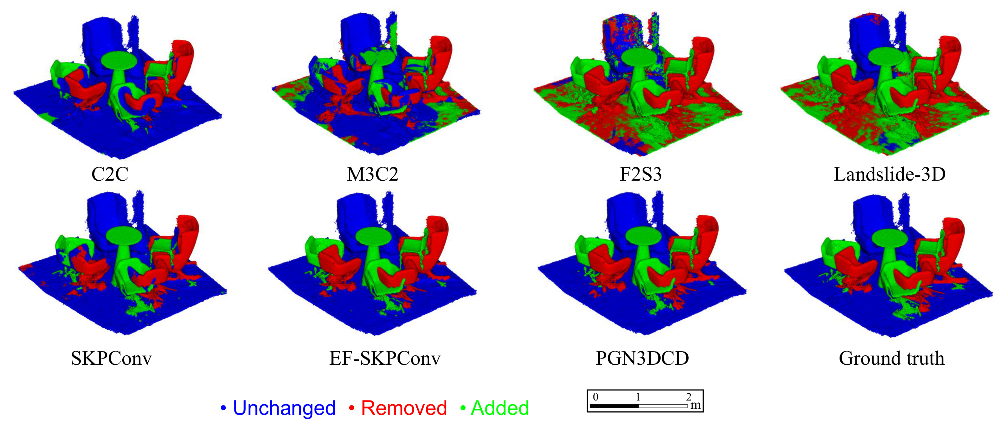
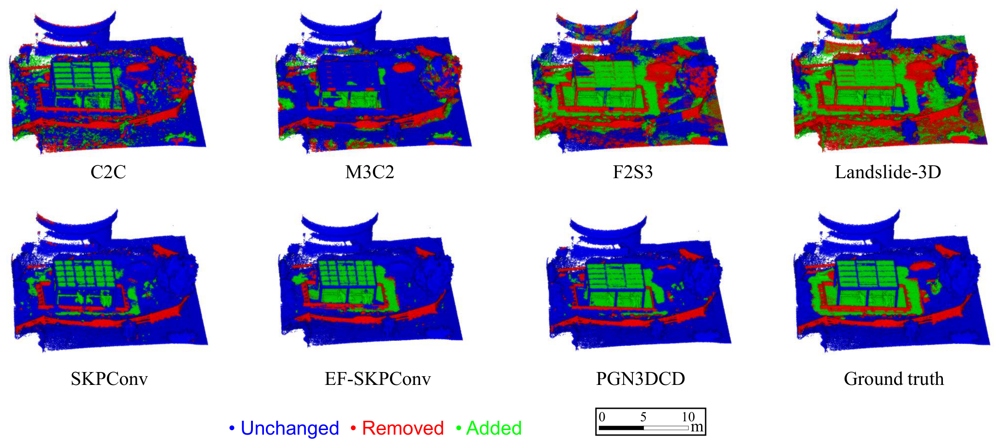
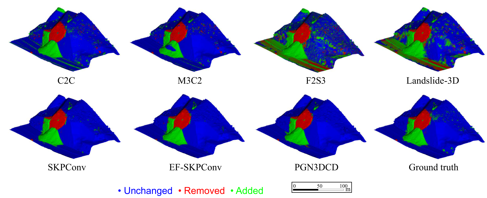

<h1 align="center">MultiChange3D</h1>
<p align="center"><strong>A Multi-Scene, Multi-Sensor Dataset for Benchmarking 3D Geometric Change Detection</strong></p>

<p align="center">
  Zhaoyi Wang<sup>1</sup> &nbsp;|&nbsp;
  Paweł Trybała<sup>2</sup> &nbsp;|&nbsp;
  Andreas Wieser<sup>1</sup> &nbsp;|&nbsp;
  Fabio Remondino<sup>2</sup>
</p>
<p align="center">
  <sup>1</sup>&nbsp;Chair of Geosensors and Engineering Geodesy (GSEG), ETH Zurich, Switzerland<br>
  <sup>2</sup>&nbsp;3D Optical Metrology (3DOM) Unit, Bruno Kessler Foundation (FBK), Trento, Italy
</p>

<p align="center">
  <a href="https://3dom-fbk.github.io/multichange3d/"></a>

  <a href="https://github.com/3DOM-FBK/multichange3d/blob/main/docs/assets/paper/Wang_et_al_2026.pdf"></a>
  <a href="https://doi.org/10.3929/ethz-c-000799657"></a>

</p>

<p align="center">
  
</p>

---

## Overview

3D change detection (3DCD) is essential for monitoring infrastructure, environmental dynamics, and natural hazards. However, existing algorithms are often evaluated on single-scene datasets, and their generalization across varied real-world scenes remains largely unexplored.

**MultiChange3D** is a multi-scene, multi-sensor 3D change detection dataset for identifying geometric changes in 3D space. The dataset provides co-registered pairs of point clouds with ground-truth geometric change labels, enabling standardized evaluation across different methods.

The dataset covers:
- **5 sensor types**: RGB-D, MLS, TLS, UAV Camera, Airborne LiDAR, and Airborne Camera
- **10 scenes** spanning indoor, outdoor, and city-scale environments
- **2 to 4 epochs** per scene, with both natural and induced changes
- Ground-truth annotations per point cloud pair: `unchanged`, `removed`, `added`

MultiChange3D is joint work between [ETH Zurich (GSEG)](https://gseg.igp.ethz.ch/) and [Bruno Kessler Foundation (3DOM-FBK)](https://3dom.fbk.eu/).

---

## Dataset

Each scene folder contains co-registered point cloud pairs and ground-truth labels for all available epoch pairs. Point clouds are provided in `.ply` format.

| Sensor Type | Scene | Approx. Points | Avg. Density (m) | Epochs | Pairs | Extra Features | Condition | Download |
|---|---|---|---|---|---|---|---|---|
| RGB-D | Office | 2 M | 0.002 | 4 | 6 | RGB | Indoor, cluttered | [Link](https://fbk.sharepoint.com/:f:/r/sites/BENCHMARKS/Shared%20Documents/MultiChange3D/0_RGBD/Office?csf=1&web=1&e=mv2t2W) |
| RGB-D | Open space (RGB-D) | 4 M | 0.002 | 4 | 6 | RGB | Indoor, furniture changes | [Link](https://fbk.sharepoint.com/:f:/r/sites/BENCHMARKS/Shared%20Documents/MultiChange3D/0_RGBD/Open_space?csf=1&web=1&e=yNfTHk) |
| MLS | Open space (MLS) | 200 k | 0.01 | 2 | 1 | Intensity | Indoor, furniture changes | [Link](https://fbk.sharepoint.com/:f:/r/sites/BENCHMARKS/Shared%20Documents/MultiChange3D/1_MLS/Open_space?csf=1&web=1&e=abc4sC) |
| MLS | Underground car parking | 24 M | 0.01 | 3 | 3 | Intensity | Indoor, vehicle motion | [Link](https://fbk.sharepoint.com/:f:/r/sites/BENCHMARKS/Shared%20Documents/MultiChange3D/1_MLS/Underground_car_parking?csf=1&web=1&e=EvwiSq) |
| MLS | Bike parking construction | 5 M | 0.02 | 4 | 6 | Intensity | Outdoor, construction | [Link](https://fbk.sharepoint.com/:f:/r/sites/BENCHMARKS/Shared%20Documents/MultiChange3D/1_MLS/Bike_parking_construction?csf=1&web=1&e=KlYuPZ) |
| MLS | Vineyard* | 5 M | 0.02 | 3 | 3 | -- | Outdoor, vegetation | [Link](https://fbk.sharepoint.com/:f:/r/sites/BENCHMARKS/Shared%20Documents/MultiChange3D/1_MLS/Vineyard?csf=1&web=1&e=rVWt1n) |
| TLS | Classroom | 40 M | 0.005 | 2 | 1 | Intensity, RGB | Indoor, furniture changes | [Link](https://fbk.sharepoint.com/:f:/r/sites/BENCHMARKS/Shared%20Documents/MultiChange3D/2_TLS/Classroom?csf=1&web=1&e=abGWOH) |
| TLS | Meeting room | 170 M | 0.003 | 2 | 1 | Intensity, RGB | Indoor, small-scale | [Link](https://fbk.sharepoint.com/:f:/r/sites/BENCHMARKS/Shared%20Documents/MultiChange3D/2_TLS/Meeting_room?csf=1&web=1&e=SgQExS) |
| UAV Camera | Landslide** | 20 M | 0.04 | 4 | 4 | RGB | Outdoor, natural terrain | [Link](https://fbk.sharepoint.com/:f:/r/sites/BENCHMARKS/Shared%20Documents/MultiChange3D/3_UAV_Camera/Landslide?csf=1&web=1&e=Fky0Wn) |
| Airborne Camera | City | 800 M | 0.05 | 2 | 1 | RGB | Simulated changes, urban | [Link](https://fbk.sharepoint.com/:f:/r/sites/BENCHMARKS/Shared%20Documents/MultiChange3D/4_Airborne_Camera/Graz_simulated_changes?csf=1&web=1&e=FEg2o3) |
| Airborne LiDAR | City | 350 M | 0.1 | 2 | 1 | Intensity, RGB | Outdoor, large-scale urban | [Link](https://fbk.sharepoint.com/:f:/r/sites/BENCHMARKS/Shared%20Documents/MultiChange3D/5_Airborne_LiDAR/Klagenfurt?csf=1&web=1&e=L9dDXA) |

\* No ground-truth change labels. \*\* Data from [Galve et al., 2025](https://doi.org/10.1007/s10346-024-02449-9).

---

## Evaluation Code

The evaluation code, including metric computation, is available in [`evaluation/`](./evaluation). Additional helper scripts are provided in [`scripts/`](./scripts).

---

## Benchmark Results

An initial benchmark is provided for 7 methods from 3 categories, evaluated on three representative scenes: *Open space (RGB-D)*, *Bike parking construction*, and *Landslide*.

**Methods evaluated:**
- **Euclidean distance-based**: C2C, M3C2
- **3D displacement estimation-based**: F2S3, Landslide-3D
- **Deep learning classification**: Siamese KPConv, EF-Siamese KPConv, PGN3DCD

<p align="center">
  
  <br><em>Qualitative results on the Open space (RGB-D) scene (epoch pair 0-2).</em>
</p>

<p align="center">
  
  <br><em>Qualitative results on the Bike parking construction scene (epoch pair 0-2).</em>
</p>

<p align="center">
  
  <br><em>Qualitative results on the Landslide scene (epoch pair 0-1).</em>
</p>

Key findings:
- Deep learning methods achieve the best scores when trained and tested on the same scene.
- Cross-scene generalization remains a significant challenge for learning-based approaches (OA drops of 16--65 pp).
- Euclidean distance-based methods (C2C, M3C2) show stable performance across scenes, but are weak in detecting overlapping changes and lack context understanding.

---

## Acknowledgements

We sincerely acknowledge the following open-source projects for supporting our evaluation:

- [F2S3](https://github.com/gseg-ethz/F2S3_pc_deformation_monitoring): A geometry-based method for 3D displacement estimation.
- [Landslide-3D](https://github.com/gseg-ethz/fusion4landslide): A multi-modal method combining 3D geometry and RGB information; only the geometry-based component is used in our evaluation.
- [Siamese KPConv](https://github.com/IdeGelis/torch-points3d-SiameseKPConv): A deep learning-based method for 3DCD.
- [EF-Siamese KPConv](https://github.com/IdeGelis/torch-points3d-SiamKPConvVariants): An enhanced variant of Siamese KPConv.
- [PGN3DCD](https://github.com/zhanwenxiao/PGN3DCD): A deep learning-based method for 3DCD.

---

## Citation

> Accepted at ISPRS Annals of the Photogrammetry, Remote Sensing and Spatial Information Sciences, proceedings of the ISPRS Congress 2026.

If you use this dataset in your research, please cite:

```bibtex
@article{wang2026multichange3d,
  title     = {{MultiChange3D}: A Multi-Scene, Multi-Sensor Dataset for Benchmarking 3D Geometric Change Detection},
  author    = {Wang, Zhaoyi and Tryba{\l}a, Pawe{\l} and Wieser, Andreas and Remondino, Fabio},
  journal   = {ISPRS Ann. Photogramm. Remote Sens. Spatial Inf. Sci.},
  year      = {2026}
}
```

---

## License

The data provided here is licensed under the [Creative Commons Attribution-NonCommercial-ShareAlike 4.0 International License](https://creativecommons.org/licenses/by-nc-sa/4.0/).

The code in this repository is licensed under the [MIT License](LICENSE).
